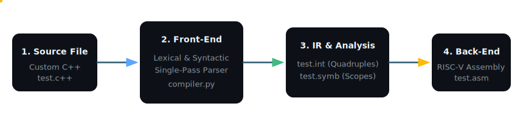

# 🚀 compiler-cpp-to-riscv

[](https://www.python.org/)
[](https://riscv.org/)
[](https://github.com/)

A lightweight, robust, and educational compiler written in **Python**. It compiles a custom C++-like programming language featuring nested functions, distinct parameter-passing modes, and complex control structures into optimized **RISC-V assembly** code.

The compiler performs lexical and syntax analysis in a single pass, generating intermediate **quadruple representations**, maintaining a scoped **symbol table**, and emitting final **RISC-V assembly**.

---

## ⚡ Animated Compilation Pipeline

Below is the live compilation flow showing how your high-level code is transformed step-by-step:



---

## ✨ Key Features

*   **🔍 Lexical Analysis (Lexer)**: Full tokenization of keywords, operators, identifiers (up to 30 chars), integers (range check `-32768` to `32767`), inline/multiline comments, and semantic errors.
*   **🏗️ Syntactic Analysis (Parser)**: Recursive descent parser that enforces the grammar and performs semantic validation.
*   **🔄 Intermediate Code (Quadruples)**: Generates linear intermediate representations (`.int` files) with quadruples like `(op, arg1, arg2, result)` for simple VM interpretation.
*   **⚡ Boolean Short-Circuiting**: Compiles boolean terms (`and`, `or`, `not`) with optimized short-circuit evaluation using label backpatching.
*   **🗄️ Scoped Symbol Table**: Supports arbitrary nesting of functions and variables, tracking activation records, variable offsets, parameters, and scopes.
*   **⚙️ RISC-V Code Generation**: Emits RISC-V assembly (`.asm` files) managing registers (`sp`, `gp`, `fp`, `ra`), static link offsets for non-local variables, and system calls for I/O.

---

## 🛠️ How to Run

Compiling source code is straightforward. Run `compiler.py` with your source file as the argument:

```bash
python compiler.py <filename>.c++
```

### Example
```bash
python compiler.py test.c++
```

### 📂 Output Files Generated
Upon a successful compilation, three files are generated next to the source:
1.  📄 **`<filename>.int`**: The intermediate representation containing the list of quadruples.
2.  📄 **`<filename>.symb`**: The symbol table structure displaying scopes, local/global variables, parameters, offsets, and function frames.
3.  📄 **`<filename>.asm`**: The final executable RISC-V assembly code ready for execution in a simulator (e.g., Venus, RARS).

---

## 📐 Supported Language Constructs

The source language is a custom C++-like language supporting:
*   **Variables**: Standard scalar variables defined using `declare`.
*   **Parameter Passing**:
    *   `in`: Passed by value (Constant Value - `CV`).
    *   `inout`: Passed by reference (Reference - `REF`).
*   **Functions**: Support nested subprograms with full access to parent scopes using access links.
*   **Extended Control Flows**:
    *   `if ... else`
    *   `while`
    *   `switchcase ... when ... default`
    *   `whilecase ... when ... default` (looping switch)
    *   `incase ... when` (executes matches and flags repeats)
    *   `forcase ... when` (loop with variable initializer)
    *   `untilcase ... when ... until` (loop repeating until condition is met)
*   **I/O**: `print` and `input` statements mapped directly to RISC-V system calls.

---

## 📦 Quadruple (IR) Reference

The intermediate code uses 4-tuple operations of the format `(operator, argument_1, argument_2, destination)`:

| Operator | Syntax | Description | Example |
| :--- | :--- | :--- | :--- |
| **`:=`** | `(:=, x, _, z)` | Assigns value `x` to `z` | `z := x` |
| **`+`, `-`, `*`, `/`** | `(+, x, y, z)` | Arithmetic operations | `z := x + y` |
| **`jump`** | `(jump, _, _, label)` | Unconditional branch to label | `goto label` |
| **`=`, `<>`, `<`, `>`, `<=`, `>=`** | `(<, x, y, label)` | Conditional branch to label | `if x < y goto label` |
| **`par`** | `(par, x, mode, _)` | Pass parameter `x` (`CV` value, `REF` ref, `RET` return val) | Passing arguments |
| **`call`** | `(call, func, _, _)` | Calls subroutine `func` | Invoke function |
| **`begin_block`** | `(begin_block, block, _, _)` | Marks start of a scope block | Function entry |
| **`end_block`** | `(end_block, block, _, _)` | Marks end of a scope block | Function exit |
| **`halt`** | `(halt, _, _, _)` | Terminates main execution | Program exit |
| **`out`** | `(out, x, _, _)` | Outputs `x` to stdout | `print x` |
| **`inp`** | `(inp, x, _, _)` | Inputs value into `x` | `input x` |

---

## 🎛️ RISC-V Register Allocation

The compiler maps variables and activation record contexts to RISC-V architecture registers:

| Register | Name | Role in Generated Code |
| :--- | :--- | :--- |
| **`sp`** | Stack Pointer | Manages the dynamic call stack and activation records (frames) |
| **`gp`** | Global Pointer | Points to the main program frame for quick access to globals |
| **`fp`** | Frame Pointer | References the activation record header of the currently executing block |
| **`ra`** | Return Address | Holds the address to return to after function execution completes |
| **`t0`** | Temporary | Used for access link parsing and loading reference address values |
| **`t1`, `t2`** | Temporaries | Used for evaluation of arithmetic, logic, and assignments |
| **`a0`, `a7`** | Arguments / System Calls | Handles standard output (printing integers/newlines) and input |

---

## 🔍 Examples & Compilation Walkthroughs

Explore how specific compiler inputs translate to IR, symbol tables, and assembly code below.

<details>
<summary>📂 Example 1: Basic Input/Output (test.c++)</summary>

### 📄 Source Code (`test.c++`)
```cpp
program test1{
    declare x;

    x := 5;
    print x;
    input x;
    x := x + 1;
    print x
}
```

### 📄 Symbol Table (`test.symb`)
```text
Scope: test1 (nesting level: 0)
  VAR: x, offset=12
  TEMP: T_1, offset=16
```

### 📄 Intermediate Code (`test.int`)
```text
1: begin_block, test1, _, _
2: :=, 5, _, x
3: out, x, _, _
4: inp, x, _, _
5: +, x, 1, T_1
6: :=, T_1, _, x
7: out, x, _, _
8: halt, _, _, _
9: end_block, test1, _, _
```

### 📄 Final RISC-V Assembly (`test.asm`)
```assembly
.data
str_nl: .asciz "\n"

.text
L0:
b Ltest1

Ltest1:
L1:
addi sp,sp,20
mv gp,sp
L2:
li t1,5
sw t1,-12(gp)
L3:
lw t1,-12(gp)
mv a0,t1
li a7,1
ecall
la a0,str_nl
li a7,4
ecall
L4:
li a7,5
ecall
sw a0,-12(gp)
L5:
lw t1,-12(gp)
li t2,1
add t1,t1,t2
sw t1,-16(gp)
L6:
lw t1,-16(gp)
sw t1,-12(gp)
L7:
lw t1,-12(gp)
mv a0,t1
li a7,1
ecall
la a0,str_nl
li a7,4
ecall
L8:
li a0,0
li a7,93
ecall
L9:
```
</details>

<details>
<summary>📂 Example 2: Functions &amp; Control Flow (test2.c++)</summary>

Demonstrates **nested functions**, **loops**, **conditional statements**, parameter modes (`in`), and **switch-case** blocks.

### 📄 Source Code (`test2.c++`)
```cpp
program test2{
    declare x, y, z;
    declare result;

    function add(in a, in b)
    {
        return a + b
    }

    function multiply(in a, in b)
    {
        declare temp;
        temp := 0;
        while temp < b
            temp := temp + 1;
        return a * b
    }

    x := 10;
    y := 20;
    z := add(in x, in y);
    result := multiply(in z, in 3);
    print result;

    if x < y
    {
        if x <> 0
            z := x + y
        else
            z := 0
    };

    while x > 0
    {
        x := x - 1;
        y := y + 2
    };

    switchcase
        when z = 30 : 
            print z
        when z > 30 : 
            z := z - 1
        default: z := 0
    ;

    incase
        when result > 100 : 
            result := result - 50
        when result <= 100 : 
            result := result + 10
    ;

    forcase x = 5
        when y > 10 : 
            y := y - 1
        when y <= 10 :
            y := y + 1
    ;

    input result;
    print result
}
```

### 📄 Symbol Table (`test2.symb`)
```text
Scope: add (nesting level: 1)
  PARAM: a, offset=12, mode=CV
  PARAM: b, offset=16, mode=CV

Scope: multiply (nesting level: 1)
  PARAM: a, offset=12, mode=CV
  PARAM: b, offset=16, mode=CV
  VAR: temp, offset=20

Scope: test2 (nesting level: 0)
  VAR: x, offset=12
  VAR: y, offset=16
  VAR: z, offset=20
  VAR: result, offset=24
  FUNC: add, startQuad=1, framelength=20, args=[(CV), (CV)]
  FUNC: multiply, startQuad=6, framelength=24, args=[(CV), (CV)]
  TEMP: T_1, offset=28
  TEMP: T_2, offset=32
  TEMP: T_3, offset=36
  TEMP: T_4, offset=40
  TEMP: T_5, offset=44
  TEMP: T_6, offset=48
  TEMP: T_7, offset=52
```
</details>

<details>
<summary>📂 Example 3: Complex Nested Scoping &amp; Math (test3.c++)</summary>

Features **multi-level nested functions**, reference passing (`inout`), factorials, multi-operator math expressions, and special loops (`incase`, `untilcase`, `forcase`).

### 📄 Source Code (`test3.c++`)
```cpp
program test3{
    declare a, b, c, d;
    declare counter, total;
    
    function factorial(in n)
    {
        declare result;
        result := 1;
        while n > 1
        {
            result := result * n;
            n := n - 1
        };
        return result
    }

    function max(in x, in y)
    {
        declare r;
        if x >= y
            r := x
        else
            r := y;
        return r
    }

    function compute(in a, in b, inout c)
    {
        declare temp;

        function helper(in val)
        {
            return val * 2 + 1
        }

        temp := helper(in a) + helper(in b);
        c := temp;
        return temp - (a + b)
    }

    a := 1;
    b := 2;
    c := 3;
    d := 0;

    d := (a + b) * (c - a) / (b + 1);
    d := a * b + c * (a + b - (c * 2));
    d := (+a) + (-b) * c;

    total := factorial(in 5);
    counter := max(in a, in b);
    d := compute(in a, in b, inout c);
    print total;
    
    // Nested flow and short-circuit evaluation
    if a = 0 or [b > 0 and c > 0]
        print 1
    else
    {
        if not [a = 0]
            print 0
    };
}
```

### 📄 Symbol Table (`test3.symb`)
```text
Scope: factorial (nesting level: 1)
  PARAM: n, offset=12, mode=CV
  VAR: result, offset=16
  TEMP: T_1, offset=20
  TEMP: T_2, offset=24

Scope: max (nesting level: 1)
  PARAM: x, offset=12, mode=CV
  PARAM: y, offset=16, mode=CV
  VAR: r, offset=20

Scope: helper (nesting level: 2)
  PARAM: val, offset=12, mode=CV
  TEMP: T_3, offset=16
  TEMP: T_4, offset=20

Scope: compute (nesting level: 1)
  PARAM: a, offset=12, mode=CV
  PARAM: b, offset=16, mode=CV
  PARAM: c, offset=20, mode=REF
  VAR: temp, offset=24
  FUNC: helper, startQuad=24, framelength=24, args=[(CV)]
  TEMP: T_5, offset=28
  TEMP: T_6, offset=32
  TEMP: T_7, offset=36
  TEMP: T_8, offset=40
  TEMP: T_9, offset=44

Scope: test3 (nesting level: 0)
  VAR: a, offset=12
  VAR: b, offset=16
  VAR: c, offset=20
  VAR: d, offset=24
  VAR: counter, offset=28
  VAR: total, offset=32
  FUNC: factorial, startQuad=1, framelength=28, args=[(CV)]
  FUNC: max, startQuad=13, framelength=24, args=[(CV), (CV)]
  FUNC: compute, startQuad=29, framelength=48, args=[(CV), (CV), (REF)]
  ...
```
</details>

---

## 🎨 Repository Graphics

*   **Interactive SVG Pipeline**: Located in [assets/pipeline.svg](./assets/pipeline.svg).
